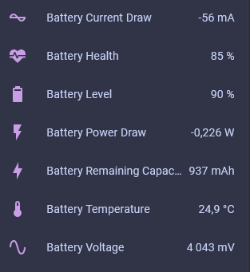

# BQ27441 battery controller component in ESPHome

This external component adds support for BQ27441 battery controller in ESPHome.

## Configuration

This device communicates over I2C, which needs to be configured.

```yaml
- source: 
    type: git
    url: https://github.com/plule/esphome-components
    ref: main
  components: [bq27441]

i2c:
  sda: GPIO21
  scl: GPIO22

sensor:
  - platform: bq27441
    # I2C Address, 0x55 is the default
    address: 0x55
    # Capacity of the plugged battery in mAh
    capacity: 1200
    # Reporting interval
    update_interval: 30s
    # Battery level in %
    battery_level:
      name: "Battery Level"
      entity_category: "diagnostic"
    # Battery voltage in mV
    battery_voltage:
      name: "Battery Voltage"
      entity_category: "diagnostic"
    # Estimated battery health in %
    battery_health:
      name: "Battery Health"
      entity_category: "diagnostic"
    # Battery temperature in ⁰C
    temperature:
      name: "Battery Temperature"
      entity_category: "diagnostic"
    # Battery power draw in W
    # Negative means discharging, positive means charging
    power:
      name: "Battery Power Draw"
      entity_category: "diagnostic"
    # Battery remaining capacity in mAh
    remaining_capacity:
      name: "Battery Remaining Capacity"
      entity_category: "diagnostic"
    # Battery current draw in mA
    # Negative means discharging, positive means charging
    current:
      name: "Battery Current Draw"
      entity_category: "diagnostic"
```

## Example reporting

As visible in Home Assistant.



## References

- The [SparkFun Arduino library by Jim Lindblom](https://github.com/sparkfun/SparkFun_BQ27441_Arduino_Library) was heavily borrowed from for this implementation
- [Technical Reference](https://www.ti.com/lit/ug/sluuac9a/sluuac9a.pdf)
- [Quickstart Guide](https://www.ti.com/lit/ug/sluuap7/sluuap7.pdf)
